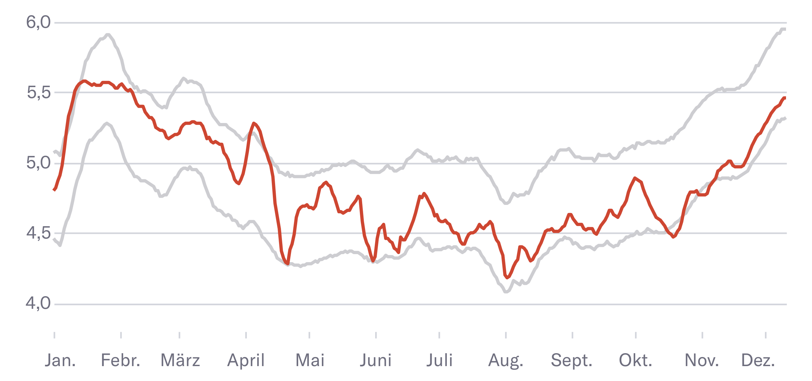

# Model: Energy Consumption in Zurich
This is the model, made by [Zurich City Electricity Company (ewz)](https://www.ewz.ch/), rewritten by [shu](https://www.nzz.ch/impressum/simon-huwiler-shu-ld.1650592) for [Neue Zürcher Zeitung](https://www.nzz.ch/). Further information at [ewz](https://www.ewz.ch/de/ueber-ewz/newsroom/aus-aktuellem-anlass/versorgung-sichergestellt/energieverbrauch-stadt-zuerich.html). See [daily updated charts here](https://www.nzz.ch/visuals/diese-grafiken-zeigen-ob-zuerich-strom-spart-ld.1710613).

<p align="center">
  
</p>

## How the model works
> The statistically expected electricity consumption generated with machine learning is calculated for the previous seven days and displayed as a daily average in a bandwidth. In addition, the actual measured weather data is used and the upper and lower limits of the statistically expected electricity consumption are calculated with a regression model (Prophet library). The actual electricity consumption is also based on the average measured values of the last seven days (rolling average) so that the two values can be compared with each other. The regression model was trained with the measured consumption and weather data of the city of Zurich from 1 January 2010 to 31 December 2021. Thanks to this procedure, deviations due to weekends and public holidays can be taken into account, as these do not fall on the same date every year and energy consumption is lower than during the week. [Source](https://www.ewz.ch/de/ueber-ewz/newsroom/aus-aktuellem-anlass/versorgung-sichergestellt/energieverbrauch-stadt-zuerich.html)

## Data sources
* [Energy Consumption data](https://data.stadt-zuerich.ch/dataset/ewz_stromabgabe_netzebenen_stadt_zuerich)
* Weather data (Meteo Schweiz)

## Why no weather data?
Although MeteoSwiss is a public authority and its data should actually be public according to Open Government Data, it is not. For legal reasons, we cannot make the weather data publicly available. We have proceeded as follows:
* **Historical data to train the model**: Write to MeteoSwiss (kundendienst@meteoswiss.ch), specify daily mean temperature for desired measuring station. We used: Value `tre200h0`, Station `REH`, Range `2010-01-01 - now`. But maybe [your desired station is already Open Data](https://opendata.swiss/de/dataset/klimamessnetz-tageswerte).
* **Current values for forecast**: Accessing the MeteoSwiss API with live data costs a lot of money. Don't do that. We scrape it directly from the website. [Have a look at this script](https://github.com/nzzdev/st-methods/blob/master/bots/strom-charts-ch/prediction_zuerich.py).

## Installation
*For Mac M1, goto: `Installation on Mac M1`*
```
python3.8 -m venv env
source env/bin/activate
pip install -r requirements.txt
```

## How to use the scripts
### 1. `PrepareTrainData.ipynb`  
This script aggregates weather and power data and created a parquet file.

### 2. `TrainFinalModel.ipynb`  
This script trains the model using the prepared data.

### 3. How to predict?
Now you are ready to make predictions. Load the model and feed it data. Like this:
```python
from prophet.serialize import model_from_json
df_predict_all = predict(Path('./zh-models/totalconsumption_rolling7day.json'), df_data, 'consumption_total')
```
You can find [a more detailed script here](https://github.com/nzzdev/st-methods/blob/master/bots/strom-charts-ch/prediction_zuerich.py).

## Good to know
Columns:
* `NE5` (Netzebene 5) = Bigger Companies
* `NE7` (Netzebene 7) = Households, small Companies (KMU)

[More infos here](https://www.swissgrid.ch/de/home/operation/power-grid/grid-levels.html)

## Installation on Mac M1
Mac Silicon is a pain... again... Scikit-Learn needs a lot of love to get installed. And Prophet does not work on newest Python Version on Mac M1 (error Message: `python3.10/site-packages/prophet/stan_model/prophet_model.bin Reason: image not found`)... And do not use the newest prophet version (1.1), you need 1.0... So:  

**Use Python 3.8!**

```
python3.8 -m venv env
source env/bin/activate
pip install -r requirements.txt
```

If Scikit-learn throws errors:
```
brew install openblas
export OPENBLAS=$(/opt/homebrew/bin/brew --prefix openblas)
export CFLAGS="-falign-functions=8 ${CFLAGS}"
pip install scikit-learn
```
[Source](https://github.com/scipy/scipy/issues/13409)

Sometimes Openblas is not linked correctly. Do:
```
brew link openblas --force
```

Other ways...
```
pip install cython pybind11 pythran numpy
OPENBLAS=$(brew --prefix openblas) CFLAGS="-falign-functions=8 ${CFLAGS}" pip install --no-use-pep517 scipy==1.3.2
```
or
```
pip3 install -U --no-use-pep517 scikit-learn
```
